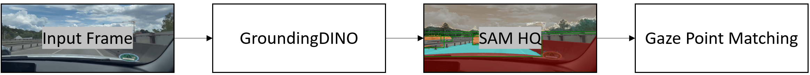

# Source Code for Eye-Tracking using Gaze-Data via [WebGazer.JS](https://github.com/brownhci/WebGazer) and [Grounded Segment Anything 2.1](https://github.com/IDEA-Research/Grounded-SAM-2)

### Installation

1. Install CUDA 12.1
2. (Windows) Make sure Visual Studio Build Tools (e.g., version 2022) are installed: [Link](https://code.visualstudio.com/docs/cpp/config-msvc)
3. We recommend using Anaconda with [Python 3.11.0](https://www.python.org/downloads/release/python-3110/) or higher
4. install `torch==2.5.1+cu121`

5. clone this repository: `git clone https://github.com/M-Colley/eye-tracking-pipeline.git`
6. run `pip install -r requirements.txt`

7. Follow installation guide of [Grounded Segment Anything 2](https://github.com/IDEA-Research/Grounded-SAM-2) (use [SAM 2.1](https://github.com/facebookresearch/sam2?tab=readme-ov-file#latest-updates)) without Docker (environment variables etc.)
8. We use `sam2.1_hiera_large.pt`, download weights from [here]([https://github.com/SysCV/sam-hq/issues/5](https://dl.fbaipublicfiles.com/segment_anything_2/092824/sam2.1_hiera_large.pt)) and put them into the root of our directory (`functions_grounding_dino.py` looks for it there)

## Notes

- could be helpful to use the Developer Command Prompt (unclear)
- Personalization: You will have to adapt your *custom prompt* for better results depending on your use case
- we also provide necessary functions to use 360-degree videos to work with yaw and pitch (`calculate_view(frame, yaw, pitch)`)
- Attention: the coding of the frames is highly important!
- the required quality of the detection can be altered by changing the values `box_threshold` and `text_threshold`. The higher the value, the fewer recognitions (true positives) but also less false positives you will find.
- Attention: `get_color_for_class` has to be adapted per use case
