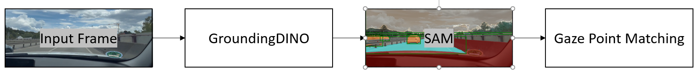

# Source Code for Eye-Tracking using Gaze-Data via [WebGazer.JS](https://github.com/brownhci/WebGazer) and [Grounded Segment Anything 2.1](https://github.com/IDEA-Research/Grounded-SAM-2) - ATTENTION: Only works on LINUX (e.g., via WSL)


# Installation of Grounded SAM2 on WSL (Ubuntu 22.04)

## 1. Install WSL
If a WSL instance is not yet installed, it can be set up using the following command:

```sh
wsl --install -d Ubuntu-22.04
```

## 2. Update System and Install Required Packages
After installing Ubuntu, update the system and install some essential packages:

```sh
sudo apt update
sudo apt upgrade -y
sudo apt install -y build-essential zlib1g-dev libncurses5-dev libgdbm-dev \
    libnss3-dev libssl-dev liblzma-dev libreadline-dev libffi-dev wget \
    libsqlite3-dev libbz2-dev
```

## 3. Install NVIDIA Toolkit
The NVIDIA Toolkit must be installed from the official website. The following steps are copied from NVIDIA's documentation: https://docs.nvidia.com/cuda/cuda-installation-guide-linux/#wsl-installation

curl and gnupg are needed for key management:

```sh
sudo apt-get install -y ca-certificates curl gnupg
```

If the old key is still present, it can be removed:

```sh
sudo apt-key del 7fa2af80
```

Now, add the new key and CUDA repository:

```sh
curl -fsSL https://developer.download.nvidia.com/compute/cuda/repos/wsl-ubuntu/x86_64/3bf863cc.pub | sudo gpg --dearmor -o /usr/share/keyrings/cuda-archive-keyring.gpg

echo "deb [signed-by=/usr/share/keyrings/cuda-archive-keyring.gpg] https://developer.download.nvidia.com/compute/cuda/repos/wsl-ubuntu/x86_64/ /" | sudo tee /etc/apt/sources.list.d/cuda-wsl.list
```

Then, update the system packages list again and install the CUDA Toolkit:

```sh
sudo apt-get update
sudo apt-get install -y cuda-toolkit-12-1
```

### 3.1. Set CUDA Environment Variables
Add the following lines to `.bashrc`:

```sh
export PATH=/usr/local/cuda-12.1/bin${PATH:+:${PATH}}
export CUDA_HOME=/usr/local/cuda-12.1
```

Then run:

```sh
source ~/.bashrc
```

## 4. Install Python (e.g., 3.10.16)
Download and install the desired Python version:

```sh
wget https://www.python.org/ftp/python/3.10.16/Python-3.10.16.tgz
tar -xvzf Python-3.10.16.tgz
cd Python-3.10.16
```

Configure and install:

```sh
./configure --enable-optimizations
make -j $(nproc)
sudo make altinstall
```

Verify the installation:

```sh
cd ..
python3.10 --version
```

## 5. Clone Grounded SAM2 and Set Up Virtual Environment
First, clone the repository:

```sh
git clone https://github.com/IDEA-Research/Grounded-SAM-2.git
cd Grounded-SAM-2
```

Then, create and activate a virtual environment:

```sh
python3.10 -m venv GSAM
source GSAM/bin/activate
```

## 6. Install PyTorch and Dependencies
Install the required packages with the appropriate CUDA versions:

```sh
pip install torch torchvision --index-url https://download.pytorch.org/whl/cu121
pip install torch==2.5.1 torchvision==0.20.1 torchaudio==2.5.1 --index-url https://download.pytorch.org/whl/cu121
```

## 7. Download Checkpoints
```sh
cd checkpoints
bash download_ckpts.sh
cd ..
cd gdino_checkpoints
bash download_ckpts.sh
cd ..
```

## 8. Install Grounded SAM2 and DINO
```sh
pip install -e .
pip install --no-build-isolation -e grounding_dino
```

Install additional dependencies for `grounding_dino`:

```sh
cd grounding_dino
pip install -r requirements.txt
```

```sh
cd ..
code .
```

---

### Using VS Code in Windows
To use the setup via VS Code in Windows, follow these steps:

1. Install the following extensions in Visual Studio Code on Windows:
   - WSL Extension
   - Python
   - Python Environment Manager

2. Close VS Code.

3. In WSL, run the following command in the project folder to open VS Code in Windows:

```sh
code .
```

4. Install extensions for WSL/Ubuntu:
   - Install the Python extension

5. Select the GSM Environment in VS Code.

6. You now have a working installation of Grounded SAM! If you have any unresolved questions, contact @ElectricUnit on GitHub

---


## Notes - Unsuccessful for Windows without WSL
### Installation

1. Install CUDA 12.1
2. (Windows) Make sure Visual Studio Build Tools (e.g., version 2022) are installed: [Link](https://code.visualstudio.com/docs/cpp/config-msvc)
3. We recommend using Anaconda with [Python 3.11.0](https://www.python.org/downloads/release/python-3110/) or higher
4. install `torch==2.5.1+cu121`

5. Clone this repository: `git clone https://github.com/M-Colley/eye-tracking-pipeline.git`
6. run `pip install -r requirements.txt`


7. Follow the installation guide of [Grounded Segment Anything 2](https://github.com/IDEA-Research/Grounded-SAM-2) (use [SAM 2.1](https://github.com/facebookresearch/sam2?tab=readme-ov-file#latest-updates)) without Docker (environment variables, etc.)
8. We use `sam2.1_hiera_large.pt`, download weights from [here]([https://github.com/SysCV/sam-hq/issues/5](https://dl.fbaipublicfiles.com/segment_anything_2/092824/sam2.1_hiera_large.pt)) and put them into the root of our directory (`functions_grounding_dino.py` looks for it there)


## Notes

- could be helpful to use the Developer Command Prompt (unclear)
- Personalization: You will have to adapt your *custom prompt* for better results, depending on your use case
- We also provide necessary functions to use 360-degree videos to work with yaw and pitch (`calculate_view(frame, yaw, pitch)`)
- Attention: the coding of the frames is highly important!
- The required quality of the detection can be altered by changing the values `box_threshold` and `text_threshold`. The higher the value, the fewer recognitions (true positives) but also less false positives you will find.
- Attention: `get_color_for_class` has to be adapted per use case
